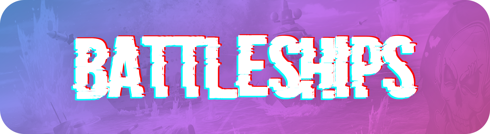

 

## Table of Contents

- [Table of Contents](#table-of-contents)
- [Sprint 4 Rubric](#sprint-4-rubric)
	- [Individual](#individual)
	- [Group](#group)
- [Sprints](#sprints)
- [Helpful Stuff](#helpful-stuff)
- [Third-Party Libraries](#third-party-libraries)

## Sprint 4 Rubric

### Individual

### Group

## Sprints

-   [Sprint 1](https://cs361fall2018.github.io/assignments/sprint1/) ([Requirements](https://cs361fall2018.github.io/docs/battleship-requirements.pdf))
-   [Sprint 2](https://cs361fall2018.github.io/assignments/sprint2/)
-   [Sprint 3](https://cs361fall2018.github.io/assignments/sprint3/) ([Requirements](https://cs361fall2018.github.io/docs/battleship-requirements.pdf))
-   [Sprint 4](https://cs361fall2018.github.io/assignments/sprint4/)

## Helpful Stuff

-   [Java Cheat Sheet](https://introcs.cs.princeton.edu/java/11cheatsheet/)
-   [Java Crash Course](http://www.cs.rpi.edu/courses/fall02/netprog/notes/javaintro.pdf)

## Third-Party Libraries

-   [TypewriterJS](https://github.com/tameemsafi/typewriterjs)
-   [SweetAlert](https://github.com/t4t5/sweetalert)
